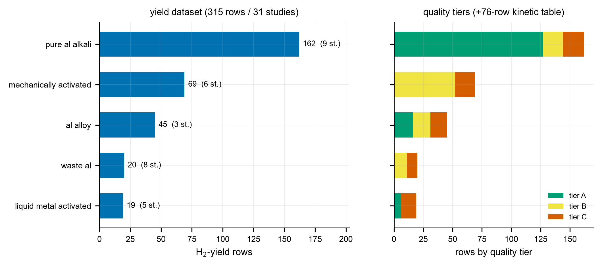
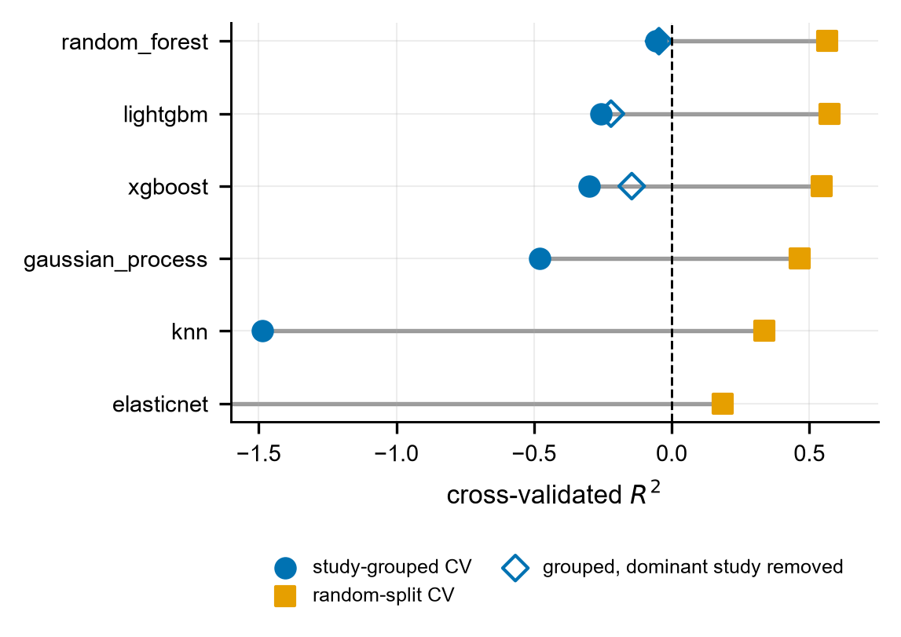
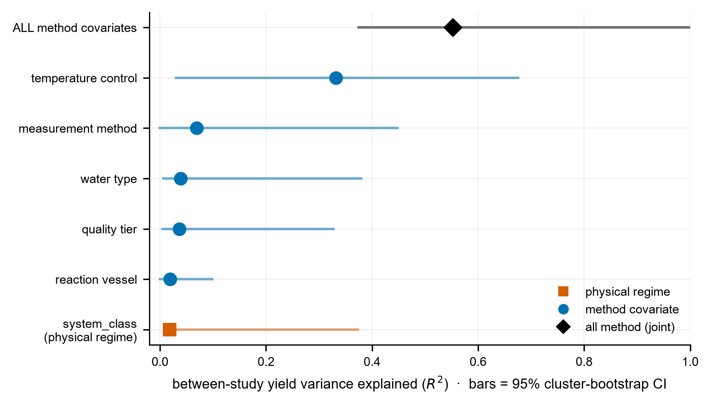
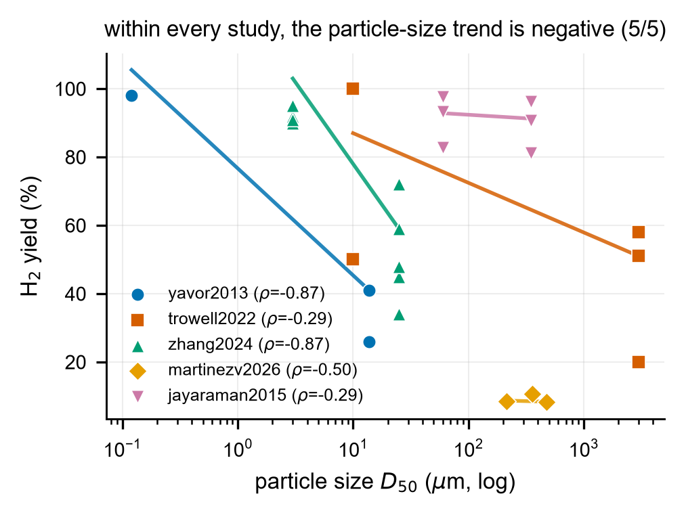
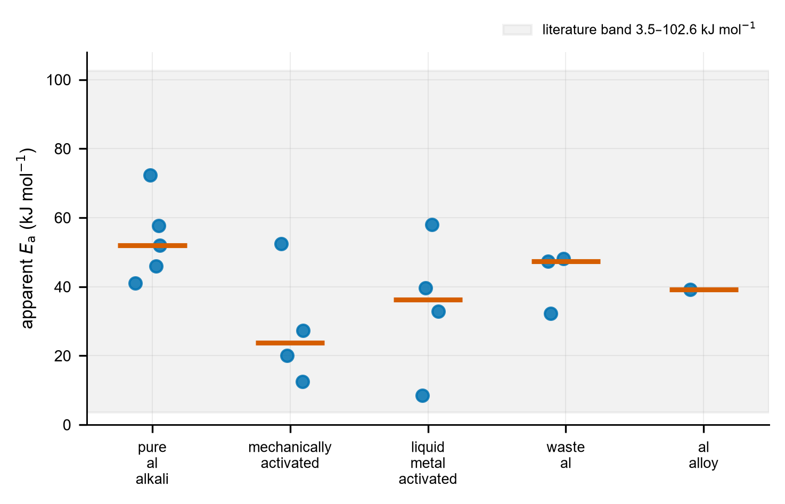
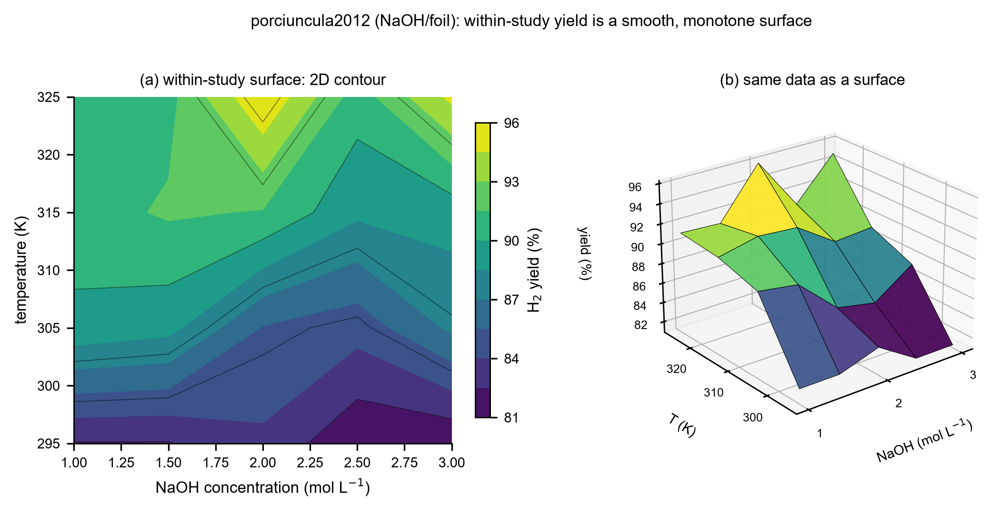

:::: frontmatter
::: keyword
aluminum--water hydrolysis ,hydrogen production ,reproducibility , data
leakage ,meta-analysis ,methodological heterogeneity ,open dataset
:::
::::

# Highlights {#highlights .unnumbered}

- 31 aluminum--water hydrolysis studies unified into one
  provenance-tracked dataset.

- Study-grouped cross-validation exposes a large optimism gap ($R^2$
  $0.62$--$0.85$).

- Methodology explains $\approx$`<!-- -->`{=html}55% of between-study
  yield variance vs $\approx$`<!-- -->`{=html}2% for regime.

- Temperature-control method alone is the single largest source
  ($\approx$`<!-- -->`{=html}33%).

- Particle-size effect is negative within all 5/5 studies; the "flip" is
  an artifact.

# Introduction

The reaction of aluminum with water,
$2\,\mathrm{Al}+3\,\mathrm{H_2O}\rightarrow
\mathrm{Al_2O_3}+3\,\mathrm{H_2}$ (or via hydroxides), is an attractive
route to hydrogen on demand: it is triggered by water alone, stores
energy at high density, and needs no high-pressure H$_2$ infrastructure.
Two decades of experiments have mapped how temperature, alkalinity,
particle size, alloying/activation, and water chemistry control the
yield and rate. Yet the resulting literature is *internally
contradictory*. Reported activation energies span
$3.5$--$102.6$ kJ mol$^{-1}$; the effect of particle size is reported as
both beneficial and detrimental; the rate--yield trade-off is
inconsistent; and studies disagree on which parameter dominates. These
contradictions are usually attributed, in passing, to "different
conditions," but the attribution has never been tested.

This is the unresolved question we address: *are the apparent
inter-study contradictions genuine physico-chemical regime differences,
or artifacts of isolated, non-standardized experimental conditions?* The
distinction matters because it determines whether the literature can be
pooled to build predictive design models at all. Prior machine-learning
work on aluminum--water hydrolysis is, to our knowledge, limited to a
single-study, in-sample neural network reporting near-perfect prediction
(Das et al. 2023). Such a near-perfect in-sample fit is exactly the
generalization illusion that a cross-study analysis must guard against:
a model that interpolates one laboratory's data says nothing about
whether the literature agrees.

We take the opposite stance. We unify the scattered literature into a
single provenance-tracked dataset and ask, with leakage-controlled
evaluation, how far one study transfers to another, and *what* accounts
for the differences when it does not. We pre-registered the analyses and
their success criteria before computing them, and we report nulls
transparently as "no detectable effect at this sample size" rather than
as evidence of absence.

#### Contributions.

- A curated, provenance-tracked, quality-tiered **open dataset** of 315
  condition-level hydrogen-yield rows from 31 studies, with a separate
  76-row kinetic table (activation energies and rates), released under
  CC-BY.

- A **leakage-controlled evaluation** showing that random-split
  predictability ($R^2\!\approx\!0.55$) collapses under study-grouped
  cross-validation ($R^2<0$; optimism gap $0.62$--$0.85$)---the
  literature does not pool naively.

- The central finding: a study-level variance decomposition in which
  **methodological covariates explain $\approx\!55\%$ of the
  between-study yield variance versus $\approx\!2\%$ for the
  physico-chemical regime**, with the temperature-control method alone
  the largest single source ($\approx\!33\%$); the effect survives
  controlling for regime.

- Resolution of the **flagship particle-size contradiction** as a
  cross-study integration artifact (within-study effect negative in
  $5/5$ studies).

- A proposed **minimum-information reporting standard** for
  aluminum-hydrolysis studies, to make future data poolable.

# Related work

#### Aluminum--water hydrolysis.

Activating aluminum so it reacts with neutral or alkaline water is a
mature experimental field. Strategies include dissolved alkali
(NaOH/KOH), bulk alloying with low-melting metals (Bi, Sn, In, Ga),
high-energy ball milling with such additives, gallium-based
liquid-metal/eutectic activation, and the use of waste or scrap aluminum
(Wen et al. 2018; Porciúncula et al. 2012; Urbonavičius et al. 2024).
Reviews of the field (Musicco et al. 2025; Preez and Bessarabov 2021)
are qualitative narrative comparisons that catalog these contradictions
but do not quantify their origin, unify the data, or test pooling.

#### The generalization illusion in single-study models.

Data-driven modeling of this reaction is nascent. The closest prior work
is a single-study artificial neural network reporting a near-perfect
in-sample fit within one laboratory's data (Das et al. 2023). In-sample
performance on one study's grid is uninformative about cross-study
transfer; our leakage analysis makes this gap explicit.

#### Leakage-controlled evaluation.

Grouped/blocked cross-validation, where all records from a group (here,
a study) are held out together, is the established defense against
optimistic in-sample estimates in materials, chemistry, and the natural
sciences (Bernett et al. 2024; John et al. 2025) (and, in chemometrics,
(Pomerantsev and Rodionova 2021)). Recent perspectives on data science
in catalysis and materials likewise stress provenance, reproducibility,
and honest generalization assessment (Suvarna and Pérez-Ramírez 2024;
Bozal-Ginesta et al. 2025; Coelho et al. 2022; Xue et al. 2024; Noble et
al. 2022). We apply this discipline to aluminum hydrolysis for the first
time and, beyond demonstrating leakage, use the variance structure to
*attribute* the between-study disagreement.

#### Methodology as a confound, and reporting standards.

Individual studies already report that protocol choices shift measured
values substantially---vessel insulation and temperature control
(Urbonavičius et al. 2023), water type, and catalyst pre-treatment (Wen
et al. 2018). Minimum-information reporting standards have improved
poolability in related areas (Wulf et al. 2021; Hoque and Guzman 2018);
we adapt that template to aluminum hydrolysis.

# Data and methods

## Provenance-tracked dataset

We screened the aluminum--water hydrolysis literature and extracted,
from 31 full-text studies in hand, every distinct experimental condition
reporting a hydrogen outcome. Each row records the target (H$_2$ yield,
% of the $1244$ mL g$^{-1}$ pure-Al theoretical), physical parameters
(temperature, alkali concentration, particle size, activator ratio,
elemental composition), categorical descriptors, full provenance (study
DOI, table/figure source, extractor, extraction method), and
quality/methodology metadata. The grouping key is the study DOI. Absent
quantities are encoded as $0$ and unreported quantities as missing,
never conflated. Each study is assigned a physico-chemical regime label
`system_class` $\in$ {`pure_al_alkali`, `al_alloy`,
`mechanically_activated`, `liquid_metal_activated`, `waste_al`},
verified against the source materials/methods. The final yield dataset
has 315 rows from 31 studies
(Fig. [1](#fig:dataset){reference-type="ref" reference="fig:dataset"});
a *separate* 76-row kinetic table holds activation energies and rates
(reported or fit from rate-vs-temperature data), with their own
provenance and fit-quality fields, and is never merged into the yield
table.

<figure id="fig:dataset" data-latex-placement="tbp">

<figcaption><strong>The curated open dataset.</strong>
Per-<code>system_class</code> yield-row counts with study counts (left)
and the A/B/C quality-tier composition (right); a separate 76-row
kinetic table is noted. 315 yield rows
from 31 studies, released under
CC-BY.</figcaption>
</figure>

Two independent re-extraction passes provide quality control: a double
extraction of $\approx\!16\%$ of yield rows showed $52/52$ exact value
agreement, and a classification audit re-derived `system_class` for all
31 studies from source; digitized kinetic points were re-read
independently ($\approx\!1.5\%$ point error). Studies whose Arrhenius
fits failed a quality gate ($R^2\!\ge\!0.90$, $\ge\!3$ temperatures)
were dropped rather than forced.

## Leakage-controlled evaluation

For each of six comparative regressors (ElasticNet, $k$NN, random
forest, XGBoost, LightGBM, Gaussian process) we estimate the held-out
coefficient of determination under two protocols: ordinary $k$-fold
(records split at random) and *study-grouped* $k$-fold (all records of a
study held out together). The *optimism gap*, $R^2_{\text{random}}-
R^2_{\text{grouped}}$, measures how much random splitting overstates
cross-study generalization. Tree models retain missing values;
linear/kernel models use median imputation and one-hot encoding.

## Between-study variance decomposition (primary analysis)

To ask *what* accounts for the disagreement, we aggregate to the study
level (one row per study: mean yield and the study's modal covariate
values) and decompose the between-study variance of mean yield. For a
categorical predictor $C$ we report the variance share
$R^2_C = 1 - \mathrm{SS_{within}}(C)/\mathrm{SS_{total}}$, comparing the
physical-regime label against methodological covariates
(`temperature_control`, `measurement_method`, `water_type`,
`quality_tier`, `vessel_type`). We test whether the methodological
signal is genuine---rather than a re-encoding of study identity or a
confound with regime---by (i) auditing the study-level coverage of each
covariate level, (ii) cross-tabulating against `system_class`, and (iii)
reporting the *incremental* variance explained by the
temperature-control method after controlling for regime. All headline
numbers carry cluster-bootstrap confidence intervals (resampling
studies); contrasts use Holm correction. We treat the kinetic
$E_\mathrm{a}$ analysis and the within-study tests analogously.

## Discipline

Hypotheses and success thresholds were frozen before computation.
Language on observational findings is associational, not causal. We
report nulls as "no detectable effect at $n\!\approx\!31$ studies /
$3$--$9$ per regime." Machine-learning attributions (SHAP/importances)
are used descriptively only. All numbers in this paper trace to a
committed analysis artifact, and the full pipeline is released.

# Results

## The literature does not pool: a large optimism gap

Under random $k$-fold splits the tree models reach $R^2\!\approx\!0.55$
(random forest $0.56$, LightGBM $0.57$, XGBoost $0.55$). Under
study-grouped cross-validation the same models fall to $R^2<0$,
i.e. worse than predicting the global mean on a held-out study, for an
optimism gap of $0.62$--$0.85$ (Fig. [2](#fig:gap){reference-type="ref"
reference="fig:gap"}). The gap persists after removing the single
largest study ($0.48$--$0.73$), so it is not an artifact of one dominant
source. A model trained on some studies therefore does not predict an
unseen study---the precondition for asking whether the contradictions
are real or artifactual.

## Methodology, not physical regime, explains the between-study variance

At the study level, $\approx\!50\%$ of the total yield variance lies
between studies. The physico-chemical regime label explains almost none
of it: $R^2_{\texttt{system\_class}}=
0.018$ (cluster-bootstrap 95% CI $[0.015,0.373]$). Methodological
covariates jointly explain $R^2=0.553$ (CI $[0.361,0.999]$),
$\approx\!27\times$ more (Fig. [3](#fig:variance){reference-type="ref"
reference="fig:variance"}). The single largest source is the
*temperature-control method*:
$R^2_{\texttt{temperature\_control}}=0.332$ (CI $[0.030,0.676]$);
studies using a self-heating protocol report higher mean yields ($86\%$)
than isothermal-bath studies ($75\%$), and uncontrolled studies far
lower ($32\%$).

This signal is not a relabeling of study identity or of physical regime.
Each temperature-control level is shared by many studies ($22/7/2$
studies for isothermal-bath/self-heating/uncontrolled) and spans
$4$--$5$ of the five regimes, so it is not collinear with
`system_class`. Its contribution *survives controlling for regime*: the
incremental variance explained by temperature control given
`system_class` is $+0.467$ (cluster-bootstrap CI $[+0.037,+0.772]$,
excluding $0$), whereas regime given method adds only $+0.153$. Residual
between-study spread remains within the dominant isothermal-bath level
(yield range $26$--$100$, s.d. $18.7$), so temperature control is the
largest single source of between-study variance, though not the only
one; hence we claim *predominantly*, not purely, methodological.

## The flagship particle-size contradiction is a cross-study artifact

The literature's headline contradiction is a direction-changing
particle-size effect. Within every study that varies particle size
($5/5$), the within-study effect has the *same* sign: smaller particles
give higher yield (Spearman $\rho$ between $-0.29$ and $-0.87$;
Fig. [4](#fig:particle){reference-type="ref" reference="fig:particle"}).
The apparent "flip" across the literature arises from comparing
different size *ranges* and material regimes between studies, not from
any within-study sign reversal. The flagship contradiction is thus an
integration artifact.

## Activation energy does not organize by regime

Reported and independently re-fit activation energies (76-row kinetic
table) do not cluster by `system_class`: the within-regime spread is
comparable to the between-regime spread, and `liquid_metal_activated`
alone ranges from $8.5$ to $58$ kJ mol$^{-1}$
(Fig. [5](#fig:ea){reference-type="ref" reference="fig:ea"}). A variance
decomposition of per-study $E_\mathrm{a}$ by regime is not significant
($\eta^2=0.36$, permutation $p=0.13$ on the $\ge\!3$-study classes). The
coarse regime label does not capture the kinetics.

## Within-study predictability is heterogeneous (a transparent null)

Whether each study is internally predictable is mixed: within-study
leave-one-condition-out skill is clearly positive for well-designed
parameter sweeps, where the response is a smooth, monotone surface
(Fig. [6](#fig:surface){reference-type="ref" reference="fig:surface"};
within-study skill $0.84$--$0.86$), but the median across 14 testable
studies is $-0.145$ (CI $[-0.45,+0.23]$). We report this as no
detectable *uniform* within-study predictability at these per-study
sample sizes ($5$--$120$ rows), not as evidence that within-study
physics is inconsistent; the between-study variance and the consistent
particle-size direction both point the other way.

<figure id="fig:gap" data-latex-placement="tbp">

<figcaption><strong>Leakage control.</strong> Each model is a dumbbell
from its study-grouped cross-validated <em>R</em>2 ( • ) to its random-split <em>R</em>2 ( ◼ ); the open diamond is the study-grouped
<em>R</em>2 after removing
the single largest study (tree models only). Tree models reach <em>R</em>2 ≈ 0.55 under random
splits but fall below zero under study-grouped cross-validation
(optimism gap 0.62–0.85): a model trained on some studies does
not predict an unseen study.</figcaption>
</figure>

<figure id="fig:variance" data-latex-placement="tbp">

<figcaption><strong>Methodology, not physical regime, explains the
between-study yield variance (headline).</strong> Between-study variance
of study-mean yield explained (<em>R</em>2, dot) with a 95%
cluster-bootstrap confidence interval (bar), one row per predictor. The
physico-chemical regime label (<code>system_class</code>) explains 0.02; all methodological covariates jointly
explain 0.55 (≈ 27×), and the temperature-control method
alone explains 0.33. Associational; the
temperature-control effect survives controlling for regime (incremental
<em>R</em>2 = +0.47,
bootstrap CI excludes 0).</figcaption>
</figure>

<figure id="fig:particle" data-latex-placement="tbp">

<figcaption><strong>The flagship particle-size contradiction is
internally consistent.</strong> Raw (<em>D</em>50, yield) points per
study (log <em>x</em>) with a robust
Theil–Sen trend line; the per-study Spearman <em>ρ</em> is in the legend. All 5/5 studies trend negative (smaller particle
⇒ higher yield), so the literature-wide
“flip” is a cross-study integration artifact, not a within-study sign
reversal.</figcaption>
</figure>

<figure id="fig:ea" data-latex-placement="tbp">

<figcaption><strong>Apparent activation energy does not organize by
physical regime.</strong> Per-study apparent <em>E</em>a (points) with a
class-median bar per <code>system_class</code>; the shaded band is the
literature range 3.5–102.6 kJ mol−1. The within-regime spread is
comparable to the between-regime spread
(<code>liquid_metal_activated</code> alone spans 8.5–58 kJ mol−1).</figcaption>
</figure>

<figure id="fig:surface" data-latex-placement="tbp">

<figcaption><strong>Within a single well-designed study the response is
smooth.</strong> <code>porciuncula2012</code> (NaOH, foil)
temperature × concentration factorial:
(a) a 2D contour and (b) the same data as a 3D surface. Within this
study the yield rises smoothly and monotonically with both temperature
and alkali concentration—within-study data are clean, locating the
contradictions in the cross-study integration. (3D shown only here,
where the data are an intrinsic response surface, and always with the 2D
companion.)</figcaption>
</figure>

# Discussion

## What the contradictions are---and are not

Taken together, the results support a single claim: the apparent
inter-study contradictions in aluminum--water hydrolysis are
*predominantly methodological*. Naive pooling overstates predictability
(the optimism gap); the physico-chemical regime label explains almost
none of the between-study variance ($\approx\!2\%$) while methodological
covariates explain the majority ($\approx\!55\%$), led by how
temperature is controlled; and the flagship particle-size contradiction
dissolves into a within-study-consistent effect. The practical
implication is direct: a hydrogen yield reported without its measurement
protocol is only weakly comparable across laboratories, and
meta-analyses that pool raw yields will inherit methodological variance
as if it were chemistry.

## Physics is not absent

"Predominantly methodological" is not "purely methodological." The
regime label is *coarse*; finer, particle-size-dependent
kinetics---tunable between nano- and micro-aluminium powders---genuinely
shape the reaction (Saceleanu et al. 2019), and such physics operates
within studies, below the resolution of a five-level label and partly
absorbed into the methodological covariates with which it co-varies. Our
attribution is also observational: because methodology is largely a
study-level attribute, the temperature-control association could be
partly confounded with other unmeasured study-level choices. We
therefore state the finding associationally and quantify, rather than
assert, its robustness.

## A minimum-information reporting standard

The remedy is standardization.
Table [1](#tab:mireport){reference-type="ref" reference="tab:mireport"}
is a minimum-information checklist for aluminum-hydrolysis studies,
ordered by how much between-study variance each field carried in our
analysis and templated on minimum-information standards in catalysis and
materials (Wulf et al. 2021; Hoque and Guzman 2018). Reporting these
items would let future yields be compared across laboratories and would
shrink the methodological variance this paper quantifies, turning the
released dataset into a growing, comparable benchmark.

::: {#tab:mireport}
  Field                 Report                                                                          Between-study $R^2$ here
  --------------------- ------------------------------------------------------------------------------- --------------------------
  Temperature control   method (isothermal bath / self-heating / uncontrolled) + setpoint or boundary   0.33
  Measurement method    water displacement / pressure / GC / mass-flow                                  0.07
  Water type & purity   DI / tap / alkaline / saline, with conductivity or grade                        0.04
  Quality / control     isothermal vs. uncontrolled; replication; value reported vs. derived            0.04
  Reaction vessel       open or closed; insulated?                                                      0.02
  Alkali                type (NaOH/KOH/none) + concentration (mol L$^{-1}$)                             ---
  Particle size         $D_{50}$ ($\mu$m) + sizing method                                               ---
  Activation route      pure / melt-alloyed / ball-milled / liquid-metal / waste                        ---
  Yield basis           theoretical reference (mL g$^{-1}$); % vs. volumetric                           ---
  Rate definition       initial / maximum / average; $t_{50}$/$t_{80}$ if a rate is claimed             ---
  Provenance            study DOI, number of conditions, replicate count                                ---

  : Proposed minimum-information reporting standard for aluminum--water
  hydrolysis hydrogen-yield studies. Items are ordered by the
  between-study yield variance each carried here (Sec. 3.2); temperature
  control is the largest single source.
:::

## Limitations

The analysis rests on 31 studies ($3$--$9$ per regime); negative results
(no regime moderation of yield; no regime structure in $E_\mathrm{a}$;
heterogeneous within-study predictability) are reported as "no
detectable effect at this sample size," not as proof of absence. The
within-study predictability test is power-limited at small per-study
$n$. Two regimes (`waste_al`, `liquid_metal_activated`) are exploratory
($<\!40$ rows). Open-access retrieval may bias the sample; we mitigate
this with a quality tier and report it as a limitation. The headline
attribution is associational, and because methodology is largely a
study-level attribute it may co-vary with unmeasured study choices.
Physics is not excluded: the coarse regime label does not capture finer,
within-study particle-size-dependent kinetics (Saceleanu et al. 2019),
so the claim is *predominantly*, not purely, methodological. Positioning
citations are complete from DOI-verified metadata; the exact in-sample
$R^2$ of the single-study prior model is to be confirmed against its
full text, and one 2021 review citation was omitted as unverifiable
rather than mis-attributed.

## Data and code availability

The curated yield dataset (315 rows), the kinetic table (76 rows), and
the full, deterministic analysis pipeline are released under CC-BY
(code: MIT). Raw third-party PDFs are not redistributed; the dataset
records DOIs and provenance so that any value can be traced to its
source.

# Conclusion

We unified the scattered aluminum--water hydrolysis literature into a
provenance-tracked, quality-tiered open dataset and used
leakage-controlled, pre-registered analysis to test whether its
long-documented contradictions are physical or methodological. The data
answer clearly, if associationally: under study-grouped evaluation naive
pooling fails, the physico-chemical regime explains $\approx\!2\%$ of
the between-study yield variance while methodological covariates explain
$\approx\!55\%$ (temperature control alone $\approx\!33\%$), and the
flagship particle-size contradiction is consistent within studies. The
contradictions are predominantly an artifact of non-standardized
measurement, not genuine regime disagreement. Beyond the finding, the
contribution is durable infrastructure---an open dataset, a reproducible
leakage-controlled benchmark, and a minimum-information reporting
standard---that can turn a contradictory literature into a comparable,
growing resource.

# Data and code availability {#data-and-code-availability-1 .unnumbered}

The curated dataset (315 condition-level yield rows and the separate
76-row kinetic table), the analysis pipeline, and the figure-generation
scripts are released openly: data under CC-BY-4.0 and code under MIT. A
versioned archive with a citable DOI is deposited at Zenodo ([\[TODO:
Zenodo DOI\]]{style="color: red"}); the development repository is at
<https://github.com/zegran/AIH2>. A dataset card documenting the schema,
provenance, quality tiers, and scope accompanies the deposit.

# Declaration of competing interest {#declaration-of-competing-interest .unnumbered}

The author declares no competing financial or personal interests.

# CRediT authorship contribution statement {#credit-authorship-contribution-statement .unnumbered}

**Dogukan Unal:** Conceptualization, Methodology, Software, Formal
analysis, Data curation, Writing -- original draft, Writing -- review &
editing, Visualization.

# Declaration of generative AI and AI-assisted technologies {#declaration-of-generative-ai-and-ai-assisted-technologies .unnumbered}

During the preparation of this work the author used generative AI agents
(Anthropic's Claude, via the Claude Code environment) for literature
triage, assistance with data extraction from source papers, statistical
analysis and analysis code, figure generation, and drafting of the
manuscript. All AI-assisted steps were carried out under the author's
direction. The author reviewed and verified all extracted data,
analyses, results, and claims, edited the AI output as needed, and takes
full responsibility for the content of this publication. The AI tools
are not listed as authors and made no independent scientific judgements.

::::::::::::::::::::: {#refs .references .csl-bib-body .hanging-indent}
::: {#ref-bernett2024 .csl-entry}
Bernett, Judith, David B. Blumenthal, Dominik G. Grimm, et al. 2024.
"Guiding Questions to Avoid Data Leakage in Biological Machine Learning
Applications." *Nature Methods* 21: 1444--53.
<https://doi.org/10.1038/s41592-024-02362-y>.
:::

::: {#ref-bozalginesta2025 .csl-entry}
Bozal-Ginesta, Carlota, Sergio Pablo-García, Changhyeok Choi, Albert
Tarancón, and Alán Aspuru-Guzik. 2025. "Developing Machine Learning for
Heterogeneous Catalysis with Experimental and Computational Data."
*Nature Reviews Chemistry*, ahead of print.
<https://doi.org/10.1038/s41570-025-00740-4>.
:::

::: {#ref-coelho2022 .csl-entry}
Coelho, Leonardo B., Dawei Zhang, Yves Van Ingelgem, Denis
Steckelmacher, Ann Nowé, and Herman Terryn. 2022. "Reviewing Machine
Learning of Corrosion Prediction in a Data-Oriented Perspective." *Npj
Materials Degradation* 6: 1--16.
<https://doi.org/10.1038/s41529-022-00218-4>.
:::

::: {#ref-das2023fuel .csl-entry}
Das, Biswajyoti, P. S. Robi, and Pinakeswar Mahanta. 2023. "Experimental
Investigation and Modelling by Machine Learning Techniques for Hydrogen
Generation by Reacting Aluminium with Aqueous NaOH Solution." *Fuel*,
ahead of print. <https://doi.org/10.1016/j.fuel.2023.128924>.
:::

::: {#ref-hoque2018 .csl-entry}
Hoque, Md Ariful, and Marcelo I. Guzman. 2018. "Photocatalytic Activity:
Experimental Features to Report in Heterogeneous Photocatalysis."
*Materials* 11 (10): 1990. <https://doi.org/10.3390/ma11101990>.
:::

::: {#ref-john2025 .csl-entry}
John, Kingsley, Daniel D. Saurette, and Brandon Heung. 2025. "The
Problematic Case of Data Leakage: A Case for Leave-Profile-Out
Cross-Validation in 3-Dimensional Digital Soil Mapping." *Geoderma*,
ahead of print. <https://doi.org/10.1016/j.geoderma.2025.117223>.
:::

::: {#ref-musicco2025 .csl-entry}
Musicco, Nicola, Marcello Gelfi, Paolo Iora, et al. 2025. "A Review of
Hydrogen Generation Methods via Aluminum-Water Reactions."
*International Journal of Thermofluids*, ahead of print.
<https://doi.org/10.1016/j.ijft.2025.101152>.
:::

::: {#ref-noble2022 .csl-entry}
Noble, Daniel W. A., Patrice Pottier, Malgorzata Lagisz, et al. 2022.
"Meta-Analytic Approaches and Effect Sizes to Account for 'Nuisance
Heterogeneity' in Comparative Physiology." *Journal of Experimental
Biology* 225 (Suppl_1). <https://doi.org/10.1242/jeb.243225>.
:::

::: {#ref-pomerantsev2021 .csl-entry}
Pomerantsev, Alexey L., and Oxana Ye. Rodionova. 2021. "Procrustes
Cross-Validation of Short Datasets in PCA Context." *Talanta* 226:
122104. <https://doi.org/10.1016/j.talanta.2021.122104>.
:::

::: {#ref-porciuncula2012 .csl-entry}
Porciúncula, C. B., N. R. Marcilio, I. C. Tessaro, and M. Gerchmann.
2012. "Production of Hydrogen in the Reaction Between Aluminum and Water
in the Presence of NaOH and KOH." *Brazilian Journal of Chemical
Engineering* 29: 337--48.
<https://doi.org/10.1590/s0104-66322012000200014>.
:::

::: {#ref-dupreez2021review .csl-entry}
Preez, S. P. du, and D. G. Bessarabov. 2021. "On-Demand Hydrogen
Generation by the Hydrolysis of Ball-Milled Aluminum Composites: A
Process Overview." *International Journal of Hydrogen Energy* 46:
35790--813. <https://doi.org/10.1016/j.ijhydene.2021.03.240>.
:::

::: {#ref-saceleanu2019 .csl-entry}
Saceleanu, Flaviu, Thu V. Vuong, Emma R. Master, and John Z. Wen. 2019.
"Tunable Kinetics of Nanoaluminum and Microaluminum Powders Reacting
with Water to Produce Hydrogen." *International Journal of Energy
Research* 43: 7384--96. <https://doi.org/10.1002/er.4769>.
:::

::: {#ref-suvarna2024 .csl-entry}
Suvarna, Manu, and Javier Pérez-Ramírez. 2024. "Embracing Data Science
in Catalysis Research." *Nature Catalysis* 7: 624--35.
<https://doi.org/10.1038/s41929-024-01150-3>.
:::

::: {#ref-urbonav2024 .csl-entry}
Urbonavičius, Marius, Šarūnas Varnagiris, Ainars Knoks, et al. 2024.
"Enhanced Hydrogen Generation Through Low-Temperature Plasma Treatment
of Waste Aluminum for Hydrolysis Reaction." *Materials* 17: 2637.
<https://doi.org/10.3390/ma17112637>.
:::

::: {#ref-urbonavicius2023 .csl-entry}
Urbonavičius, Marius, Šarūnas Varnagiris, Ainars Mezulis, et al. 2023.
"Hydrogen from Industrial Aluminium Scraps: Hydrolysis Under Various
Conditions, Modelling of pH Behaviour and Analysis of Reaction
by-Product." *International Journal of Hydrogen Energy*, ahead of print.
<https://doi.org/10.1016/j.ijhydene.2023.09.065>.
:::

::: {#ref-wen2018 .csl-entry}
Wen, Yu-Chieh, Wei-Min Huang, and Hong-Wen Wang. 2018. "Kinetics Study
on the Generation of Hydrogen from an Aluminum/Water System Using
Synthesized Aluminum Hydroxides." *International Journal of Energy
Research*, ahead of print. <https://doi.org/10.1002/er.3955>.
:::

::: {#ref-wulf2021 .csl-entry}
Wulf, Christoph, Matthias Beller, Tim Boenisch, et al. 2021. "A Unified
Research Data Infrastructure for Catalysis Research -- Challenges and
Concepts." *ChemCatChem* 13. <https://doi.org/10.1002/cctc.202001974>.
:::

::: {#ref-xue2024 .csl-entry}
Xue, Pengcheng, Ruihu Qiu, Cheng Peng, et al. 2024. "Solutions for
Lithium Battery Materials Data Issues in Machine Learning: Overview and
Future Outlook." *Advanced Science* 11.
<https://doi.org/10.1002/advs.202410065>.
:::
:::::::::::::::::::::
